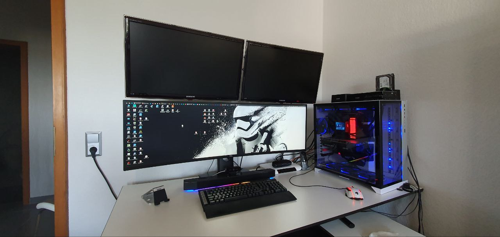

# Uses

Occasionally I'm asked what tools I use regularly so I've put together this "uses" document to list them out in detail.

## Hardware

My primary workhorse is a selfbuild Desktop Machine. For Traveling i use my Dell XPS15.

### Specs

|             |                              |
| ----------- | ---------------------------- |
| **CASE**    | Lian Li O11 Dynamic EVO XL   |
| **CPU**     | AMD Ryzen9 @ 3.8 GHz         |
| **COOLING** | ASUS RYUJIN II               |
| **RAM**     | 32 GB @ 3600MHz              |
| **GFX**     | NVIDIA 2080RTX OC            |
| **Disk**    | 2 GB NVMe SSD Raid           |
| **Screen**  | 49.0" UWQHD+ (5120 x 1440)   |
| **Screen**  | 2x 27.0" FHD (1920 x 1080)   |
| **PSU**     | BeQuiet DARK Power Pro 1200w |
| **FANS**    | 7xThermaltake Riing 12 RGB   |

## Operating System

I use Windows10 as my daily driver with a WSL2 Debian installed.

## Editor

For webdevelopment I use Windows 10 and a Debian Linux Subsystem and [Visual Studio Code](https://code.visualstudio.com) with the [SynthWave '84](https://marketplace.visualstudio.com/items?itemName=RobbOwen.synthwave-vscode) theme and the [Material Icon Theme](https://marketplace.visualstudio.com/items?itemName=PKief.material-icon-theme) icon pack.

### VS Code Extensions

The following are some (but not all) of the extensions I use on a daily basis.

#### General

Extensions installed on WSL: Debian:

#### API

- [OpenAPI (Swagger) Editor](https://marketplace.visualstudio.com/items?itemName=42crunch.vscode-openapi)
- [Thunder Client](https://marketplace.visualstudio.com/items?itemName=rangav.vscode-thunder-client)

#### AI

- [GitHub Copilot](https://marketplace.visualstudio.com/items?itemName=github.copilot)
- [GitHub Copilot Chat](https://marketplace.visualstudio.com/items?itemName=github.copilot-chat)

#### EDITOR

- [Toggle Excluded Files](https://marketplace.visualstudio.com/items?itemName=amodio.toggle-excluded-files)
- [Goto definition alias](https://marketplace.visualstudio.com/items?itemName=antfu.goto-alias)
- [German Language Pack for Visual Studio Code](https://marketplace.visualstudio.com/items?itemName=ms-ceintl.vscode-language-pack-de)
- [Live Share](https://marketplace.visualstudio.com/items?itemName=ms-vsliveshare.vsliveshare)
- [Terminals Manager](https://marketplace.visualstudio.com/items?itemName=fabiospampinato.vscode-terminals)
- [Todo+](https://marketplace.visualstudio.com/items?itemName=fabiospampinato.vscode-todo-plus)
- [GitLens — Git supercharged](https://marketplace.visualstudio.com/items?itemName=eamodio.gitlens)
- [Prettier - Code formatter](https://marketplace.visualstudio.com/items?itemName=esbenp.prettier-vscode)
- [i18n Ally](https://marketplace.visualstudio.com/items?itemName=lokalise.i18n-ally)
- [Inline fold](https://marketplace.visualstudio.com/items?itemName=moalamri.inline-fold)
- [SFTP](https://marketplace.visualstudio.com/items?itemName=natizyskunk.sftp)
- [Vetur](https://marketplace.visualstudio.com/items?itemName=octref.vetur)
- [XML](https://marketplace.visualstudio.com/items?itemName=redhat.vscode-xml)
- [YAML](https://marketplace.visualstudio.com/items?itemName=redhat.vscode-yaml)
- [html-validate](https://marketplace.visualstudio.com/items?itemName=tobiashansson.html-validate-vscode)

#### PHP

- [PHP Intelephense](https://marketplace.visualstudio.com/items?itemName=bmewburn.vscode-intelephense-client)
- [PHP Namespace Resolver](https://marketplace.visualstudio.com/items?itemName=MehediDracula.php-namespace-resolver)
- [laravel-blade](https://marketplace.visualstudio.com/items?itemName=cjhowe7.laravel-blade)
- [Simple PHP CS Fixer 3](https://marketplace.visualstudio.com/items?itemName=PHLAK.simple-php-cs-fixer-3)
- [PHP Static Analysis](https://marketplace.visualstudio.com/items?itemName=breezelin.phpstan)
- [PHP Debug](https://marketplace.visualstudio.com/items?itemName=xdebug.php-debug)
- [phpcs](https://marketplace.visualstudio.com/items?itemName=ikappas.phpcs)
- [PHP IntelliSense](https://marketplace.visualstudio.com/items?itemName=zobo.php-intellisense)

#### JavaScript

- [Vue Language Features (Volar)](https://marketplace.visualstudio.com/items?itemName=Vue.volar)
- [Prettier - Code formatter](https://marketplace.visualstudio.com/items?itemName=esbenp.prettier-vscode)
- [ESLint](https://marketplace.visualstudio.com/items?itemName=dbaeumer.vscode-eslint)

#### STYLE

- [Iconify IntelliSense](https://marketplace.visualstudio.com/items?itemName=antfu.iconify)
- [UnoCSS](https://marketplace.visualstudio.com/items?itemName=antfu.unocss)
- [Tailwind CSS IntelliSense](https://marketplace.visualstudio.com/items?itemName=bradlc.vscode-tailwindcss)
- [Stylelint](https://marketplace.visualstudio.com/items?itemName=stylelint.vscode-stylelint)
- [Sass (.sass only)](https://marketplace.visualstudio.com/items?itemName=syler.sass-indented)

## Browser

- Firefox (Primary)
- Firefox Dev
- Chrome
- Chrome Dev
- Edge
- Brave
- Opera

### Browser Extensions

- Consent-o-matic
- Facebook Container
- Flagfox
- Simple Tab Groups
- uBlock Origin
- Vue Dev Tools

## Other Software

- [Git Source Control](https://git-scm.com)
- [Docker](https://www.docker.com) + [Docker Compose](https://docs.docker.com/compose/)
- [Total Commander](https://www.ghisler.com)
- [Royal TS](https://www.royalapps.com)

## AI

## Workspace

When working from home i work on my desk with:

- [Dell U4919DW](https://www.amazon.de/Dell-EMC-tft-U4919DW-49in/dp/B07KMQT7DB)
- [Steelcase Gesture Chair](https://de.steelcase.com/products/gesture)
- [Headset H3PRO Hybrid – White](https://www.eposaudio.com/de/de/gaming/products/h3pro-hybrid-white-bluetooth-low-latency-connection-gaming-headset-1000893)
- [Roccat Kone Aimo - White](https://de.roccat.com/products/kone-aimo-remastered)
- [Keyboard K95 RGB PLATINUM XT – CHERRY MX SPEED](https://www.corsair.com/de/de/p/keyboards/ch-9127414-na/k95-rgb-platinum-xt-mechanical-gaming-keyboard-cherry-mx-speed-na-layout-ch-9127414-na)
- [Soundbar Sound BlasterX Katana](https://de.creative.com/p/speakers/sound-blasterx-katana)
- [Nulaxy Foldable Stand](https://www.amazon.de/gp/product/B01M62548J/ref=ppx_yo_dt_b_search_asin_title?ie=UTF8&psc=1)

## On the Go

When i travel i use:

- [Dell XPS 15 9550 4k Ultrabook](https://www.dell.com/support/home/de-de/product-support/product/xps-15-9550-laptop/overview)
- [Microsoft Sculpt Comfort Maus Wireless](https://www.microsoft.com/de-de/d/microsoft-sculpt-comfort-maus/8zg8rps4tcgc?activetab=pivot:%C3%BCbersichttab)
- [Jabra Elite 4 Active](https://www.jabra.com.de/bluetooth-headsets/jabra-elite-4-active)
